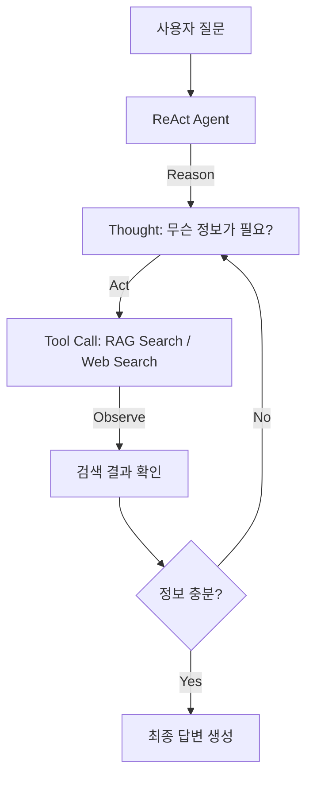

# V3 Feature 1: Agentic RAG (ReAct Pattern)

## 개요
기존의 RAG는 "검색 -> 생성" 단방향 파이프라인입니다.
Agentic RAG는 LLM 스스로 **사고(Reasoning) -> 행동(Action) -> 관찰(Observation)** 루프를 반복하여 정답에 도달합니다.

## 아키텍처



## Embabel Agent 적용

Embabel 프레임워크의 `@Action`과 `@AchievesGoal` 어노테이션을 활용하여 ReAct 패턴을 구현합니다.

### 핵심 개념 (Embabel)
1. **Goal**: 에이전트가 달성해야 할 최종 목표 (`@AchievesGoal`)
2. **Action**: 목표를 향해 수행하는 개별 작업 (`@Action`)
3. **Blackboard (AgentProcess)**: 액션 간에 공유되는 상태 정보

### 구현 방안

```kotlin
@Agent
class AgenticRagAgent(
    private val ragTool: KnowledgeSearchTool,
    private val webSearchTool: TavilySearchTool
) {

    @Action
    fun reason(query: UserQuery, context: OperationContext): ThoughtResult {
        // LLM에게 다음 행동을 결정하도록 요청
        return context.ai()
            .withDefaultLlm()
            .createObject("""
                Given the question: "${query.text}"
                Decide what information you need to find.
                Output: { "thought": "...", "action": "RAG_SEARCH" | "WEB_SEARCH" | "ANSWER", "actionInput": "..." }
            """, ThoughtResult::class.java)
    }

    @Action(toolGroups = ["knowledge-rag", CoreToolGroups.WEB])
    fun act(thought: ThoughtResult, context: OperationContext): Observation {
        return when (thought.action) {
            "RAG_SEARCH" -> Observation(ragTool.search(thought.actionInput))
            "WEB_SEARCH" -> Observation(webSearchTool.search(thought.actionInput))
            else -> Observation.FINAL // 답변 준비됨
        }
    }

    @AchievesGoal("Generate accurate answer using iterative reasoning")
    @Action
    fun answer(observations: List<Observation>, context: OperationContext): FinalAnswer {
        // 모든 관찰 결과를 종합하여 최종 답변 생성
        return context.ai().withDefaultLlm().createObject(
            "Based on the following observations...", FinalAnswer::class.java
        )
    }
}
```

## 구현 해야 할 항목
1. `ReActResult`, `Observation` 등 데이터 클래스 정의
2. 최대 루프 횟수 제한 (무한 루프 방지)
3. 관찰 결과 누적 및 프롬프트 주입 로직
