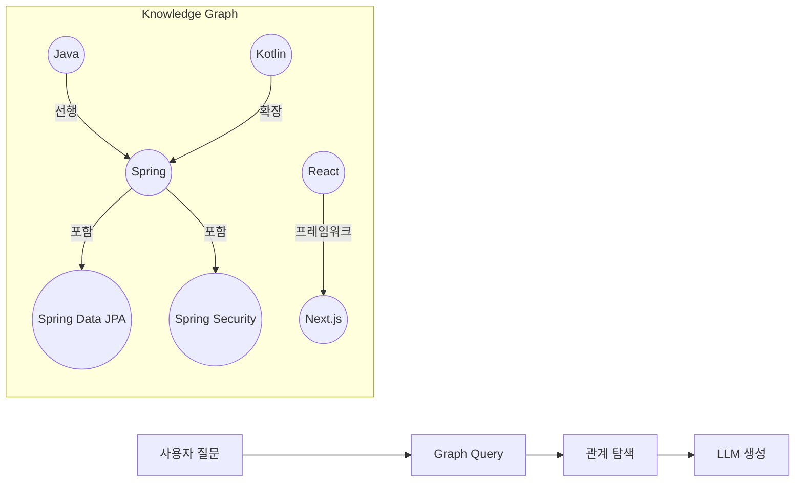

# V3 Feature 2: GraphRAG (Knowledge Graph)

## 개요
기존 벡터 검색(Semantic Search)은 개별 문서 단위로 검색합니다.
GraphRAG는 **엔티티 간의 관계(Edge)를 지식 그래프(Knowledge Graph)로 구축**하여 관계형 질문에 강점을 보입니다.

## 아키텍처



## 기술 관계 스키마

### Node Types
| Type | 설명 | 예시 |
|------|------|------|
| `Technology` | 기술/프레임워크 | Java, Spring, React |
| `Concept` | 개념 | DI, IoC, REST |
| `Book` | 학습 자료 | "자바의 정석", "Real MySQL" |

### Edge Types
| Type | 설명 | 예시 |
|------|------|------|
| `DEPENDS_ON` | 선행 지식 | (Spring)-[DEPENDS_ON]->(Java) |
| `CONTAINS` | 포함 관계 | (Spring)-[CONTAINS]->(JPA) |
| `RECOMMENDED_AFTER` | 학습 순서 | (HTML)-[RECOMMENDED_AFTER]->(CSS) |
| `LEARNED_BY` | 학습 자료 | (Java)-[LEARNED_BY]->("자바의 정석") |

## 구현 방안

### 옵션 A: Neo4j 사용 (권장)
- **장점**: 강력한 Cypher 쿼리 언어, 그래프 시각화 도구
- **단점**: 추가 인프라 필요

```kotlin
@Service
class TechKnowledgeGraphService(private val neo4jTemplate: Neo4jTemplate) {

    fun findLearningPath(from: String, to: String): List<Technology> {
        return neo4jTemplate.query("""
            MATCH path = shortestPath(
                (start:Technology {name: $from})-[*]->(end:Technology {name: $to})
            )
            RETURN nodes(path) AS path
        """, mapOf("from" to from, "to" to to))
    }

    fun findPrerequisites(tech: String): List<Technology> {
        return neo4jTemplate.query("""
            MATCH (t:Technology {name: $tech})-[:DEPENDS_ON*]->(prereq:Technology)
            RETURN prereq
        """, mapOf("tech" to tech))
    }
}
```

### 옵션 B: Qdrant + Metadata로 간이 구현
- **장점**: 기존 인프라 재활용
- **단점**: 복잡한 관계 탐색 한계

```kotlin
// 시드 데이터에 관계 메타데이터 추가
val document = Document(
    content = "Spring Framework is a Java-based framework...",
    metadata = mapOf(
        "technology" to "spring-framework",
        "depends_on" to listOf("java", "kotlin"),
        "contains" to listOf("spring-mvc", "spring-aop")
    )
)
```

## 구현 해야 할 항목
1. 현재 시드 데이터에서 관계 정보 추출
2. 그래프 DB 연동 또는 메타데이터 기반 간이 그래프 구현
3. `GraphQueryTool` 구현 (선행 기술, 학습 경로 탐색)
