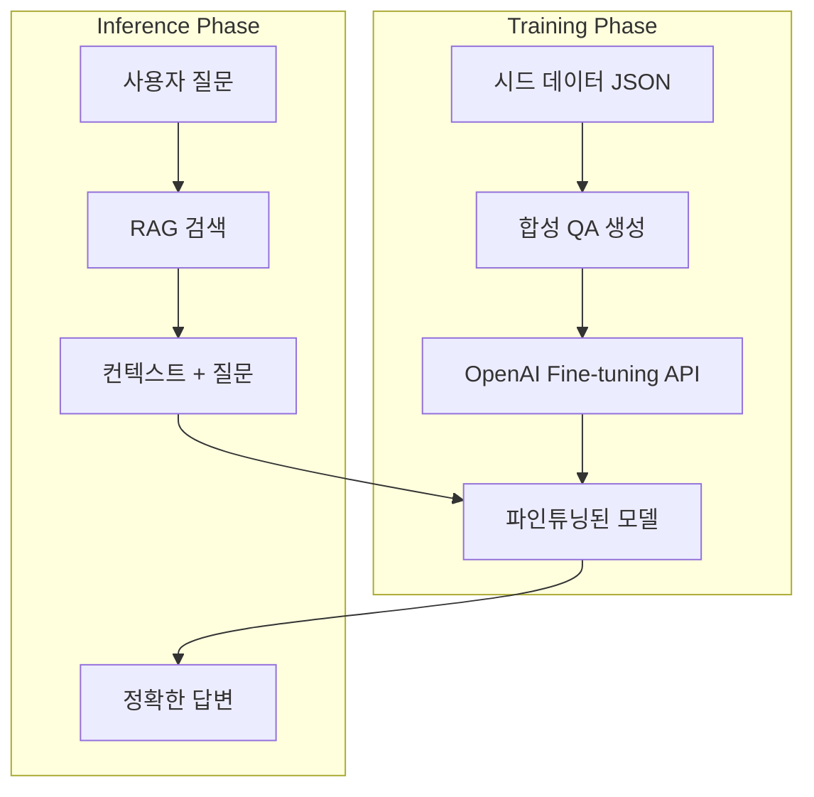

# V3 Feature 3: RAFT (Retrieval Augmented Fine-Tuning)

## 개요
RAFT는 RAG + Fine-tuning의 결합입니다.
범용 LLM 대신, **우리 도메인(기술 학습 로드맵)에 맞게 파인튜닝된 모델**을 사용하여 환각(Hallucination)을 줄이고 성능을 높입니다.

## 아키텍처



## 핵심: 합성 데이터 생성 (Distractor 포함)

RAFT의 핵심은 **"Distractor Document"(오답 문서)** 를 포함하여 학습시키는 것입니다.
이로써 모델은 관련 없는 정보를 무시하고 정확한 정보만 골라내는 능력을 학습합니다.

### 데이터 포맷

```json
{
  "messages": [
    {"role": "system", "content": "You are a helpful tech learning assistant. Answer based ONLY on the provided context."},
    {"role": "user", "content": "Question: Spring Boot와 Spring Framework의 차이점은?\n\n<context>\n[RELEVANT] Spring Boot는 Spring Framework 위에 구축된 도구로...\n[DISTRACTOR] React는 Facebook이 만든 프론트엔드 라이브러리...\n[DISTRACTOR] Docker는 컨테이너 가상화 기술...\n</context>"},
    {"role": "assistant", "content": "Based on the context, Spring Boot is built on top of Spring Framework and provides auto-configuration... The answer is derived from the [RELEVANT] document, ignoring irrelevant information about React and Docker."}
  ]
}
```

## OpenAI Fine-tuning 프로세스

### 1. 데이터셋 생성 스크립트 (Python)

```python
import json
import openai

def generate_qa_pair(seed_document):
    """시드 문서에서 QA 쌍 생성"""
    response = openai.chat.completions.create(
        model="gpt-4o",
        messages=[
            {"role": "system", "content": "Generate a question and chain-of-thought answer based on this document."},
            {"role": "user", "content": seed_document}
        ]
    )
    return json.loads(response.choices[0].message.content)

def create_training_data(seed_files, distractor_docs, output_path):
    """RAFT 형태의 학습 데이터 생성"""
    training_data = []
    for seed in seed_files:
        qa = generate_qa_pair(seed)
        # 랜덤하게 2-3개의 distractor 추가
        distractors = random.sample(distractor_docs, 3)
        training_data.append(format_for_openai(qa, seed, distractors))
    
    with open(output_path, 'w') as f:
        for item in training_data:
            f.write(json.dumps(item) + '\n')
```

### 2. Fine-tuning 요청

```bash
# 파일 업로드
openai api files.create \
  -f training_data.jsonl \
  -p fine-tune

# Fine-tuning 작업 생성
openai api fine_tuning.jobs.create \
  -t file-abc123 \
  -m gpt-4o-mini-2024-07-18
```

### 3. 파인튜닝된 모델 사용 (Kotlin)

```kotlin
@Configuration
class RaftModelConfig {

    @Value("\${skillweaver.raft.model-id}")
    private lateinit var raftModelId: String // 예: "ft:gpt-4o-mini-2024-07-18:my-org:skillweaver:abc123"

    @Bean
    fun raftChatClient(openAi: OpenAiApi): OpenAiChatModel {
        return OpenAiChatModel(openAi, OpenAiChatOptions.builder()
            .model(raftModelId)
            .temperature(0.3)
            .build()
        )
    }
}
```

## 구현 해야 할 항목
1. Python 스크립트로 합성 QA 데이터셋 생성 (`scripts/raft_data_generator.py`)
2. 50-100개의 학습 데이터 생성 (시드 데이터 42개 파일 활용)
3. OpenAI Fine-tuning 요청 및 모델 ID 획득
4. `application.yml`에 파인튜닝 모델 ID 설정
5. RAG 파이프라인에서 파인튜닝된 모델 호출 옵션 추가

## 비용 예측
- GPT-4o-mini 파인튜닝: ~$3/1M tokens (학습), $0.60/1M tokens (추론)
- 약 50개 QA 쌍: 약 $1-2 학습 비용 (매우 저렴)
